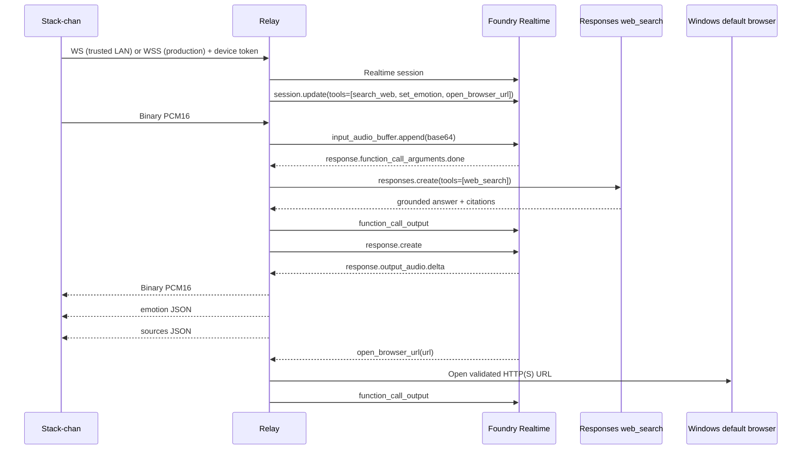

# Architecture

## Responsibility split

### Stack-chan

- Capture PCM16 24 kHz mono audio.
- Send audio as WebSocket binary frames.
- Receive binary PCM audio and play it.
- Render relay state (`ready`, `listening`, `thinking`, `searching`, `speaking`, `error`).
- Render Relay-provided expression hints and a local search animation.
- Hold only a device credential. Azure credentials never reside on the device.

### Relay / Agent Orchestrator

- Authenticate devices.
- Run on a Windows PC in the same trusted LAN as Stack-chan.
- Maintain one Foundry Realtime session per device WebSocket.
- Convert binary PCM to/from Realtime base64 audio events.
- Register and execute tool calls.
- Call Responses API `web_search` as the only RAG knowledge source.
- Return citations separately to the device.
- Execute explicitly registered Windows-local functions.
- Centralize future MCP / business API / internal RAG extensions.

## Sequence

## Local-first deployment

The normal deployment is a Windows PC on the same trusted LAN as Stack-chan.
The Manager UI binds to loopback only, while the device WebSocket listens on
port 8080 on the LAN. Foundry remains the model provider; only the Relay runtime
location changes.

Azure Container Apps files inherited in `infra/` are optional and are not used
by the local-first path.

## Initial operating mode

The software structure supports duplex communication, but v0.1 runs half duplex at the device: capture pauses while assistant audio is playing. AEC and barge-in are later phases.
