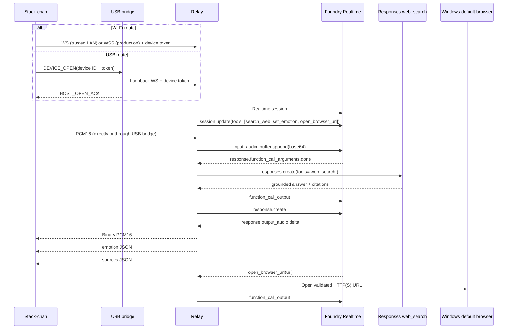

**日本語** | [English](en/architecture.md)

# アーキテクチャ

## 責務の分担

### Stack-chan

- PCM16 24 kHz モノラル音声をキャプチャする。
- Wi-Fi WebSocket または USB シリアルエンベロープを介して、JSON 制御メッセージと PCM 音声を送受信する。
- 永続化する Relay ルートとして `AUTO`、`WI-FI`、`USB` のいずれかを選択する。`AUTO` では起動時に USB を優先し、USB を利用できない場合は Wi-Fi にフォールバックする。
- PCM 音声を受信して再生する。
- Relay の状態（`ready`、`listening`、`thinking`、`searching`、`speaking`、`error`）を表示する。
- Relay から提供される表情ヒントと、ローカルの検索アニメーションを表示する。
- 保持する認証情報はデバイス用のみとする。Azure の認証情報はデバイスに一切配置しない。

### USB ブリッジ

- Windows Manager の管理下で Relay と並行して動作する。
- Espressif の USB シリアルポートを検出し、COBS フレーム化および CRC 保護されたパケットを Stack-chan と送受信する。
- 指定されたデバイス ID とトークンを使用して Relay へのループバック WebSocket を開き、`DEVICE_OPEN` リクエストを認証する。
- Relay プロトコルの JSON テキストおよび PCM バイナリメッセージの種別を、双方向で維持する。
- Relay からデバイスへの音声送信速度を調整し、接続、フレーミング、シーケンス欠落の診断情報を Manager UI に公開する。

### Relay / Agent Orchestrator

- デバイスを認証する。
- Stack-chan と同じ信頼済み LAN 内の Windows PC で動作する。
- 認証済みデバイス接続ごとに Foundry Realtime セッションを 1 つ維持する。
- バイナリ PCM と Realtime の base64 音声イベントを相互変換する。
- ツール呼び出しを登録して実行する。
- 唯一の RAG ナレッジソースとして Responses API の `web_search` を呼び出す。
- 引用情報をデバイスへ個別に返す。
- 明示的に登録された Windows ローカル関数を実行する。
- 将来の MCP、ビジネス API、社内 RAG の拡張を集約する。

## シーケンス

## ローカル優先のデプロイ

通常は、Stack-chan と同じ信頼済み LAN 内の Windows PC にデプロイする。Manager UI はループバックのみにバインドし、デバイス用 WebSocket は LAN 上のポート 8080 で待ち受ける。Manager は Relay とともに USB ブリッジを起動し、ブリッジはループバック経由で同じデバイス用 WebSocket に接続する。モデルプロバイダーは引き続き Foundry であり、変更されるのは Relay の実行場所のみである。

`infra/` に継承されている Azure Container Apps のファイルは任意であり、ローカル優先の構成では使用しない。

## 初期動作モード

ソフトウェア構成は双方向通信に対応しているが、v0.1 のデバイス側は半二重で動作する。アシスタント音声の再生中はキャプチャを一時停止する。AEC とバージインは後続フェーズで対応する。
