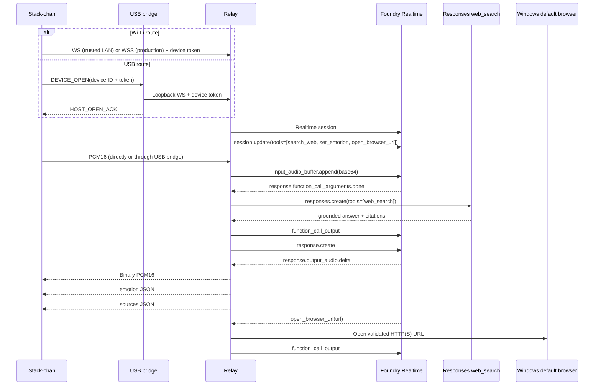

[日本語](../architecture.md) | **English**

# Architecture

## Responsibility split

### Stack-chan

- Capture PCM16 24 kHz mono audio.
- Exchange JSON control messages and PCM audio over either Wi-Fi WebSocket or
  the USB serial envelope.
- Select `AUTO`, `WI-FI`, or `USB` as the persisted Relay route. In `AUTO`,
  prefer USB at startup and fall back to Wi-Fi when USB is unavailable.
- Receive PCM audio and play it.
- Render relay state (`ready`, `listening`, `thinking`, `searching`, `speaking`, `error`).
- Render Relay-provided expression hints and a local search animation.
- Hold only a device credential. Azure credentials never reside on the device.

### USB bridge

- Run beside the Relay under the Windows Manager.
- Discover Espressif USB serial ports and exchange COBS-framed, CRC-protected
  packets with Stack-chan.
- Authenticate `DEVICE_OPEN` requests by opening a loopback WebSocket to the
  Relay with the supplied device ID and token.
- Preserve the Relay protocol's JSON text and PCM binary message types in both
  directions.
- Pace Relay-to-device audio and expose connection, framing, and sequence-gap
  diagnostics to the Manager UI.

### Relay / Agent Orchestrator

- Authenticate devices.
- Run on a Windows PC in the same trusted LAN as Stack-chan.
- Maintain one Foundry Realtime session per authenticated device connection.
- Convert binary PCM to/from Realtime base64 audio events.
- Register and execute tool calls.
- Call Responses API `web_search` as the only RAG knowledge source.
- Return citations separately to the device.
- Execute explicitly registered Windows-local functions.
- Centralize future MCP / business API / internal RAG extensions.

## Sequence

## Local-first deployment

The normal deployment is a Windows PC on the same trusted LAN as Stack-chan.
The Manager UI binds to loopback only, while the device WebSocket listens on
port 8080 on the LAN. The Manager starts the USB bridge alongside the Relay;
the bridge reaches that same device WebSocket through loopback. Foundry remains
the model provider; only the Relay runtime location changes.

Azure Container Apps files inherited in `infra/` are optional and are not used
by the local-first path.

## Initial operating mode

The software structure supports duplex communication, but v0.1 runs half duplex at the device: capture pauses while assistant audio is playing. AEC and barge-in are later phases.
